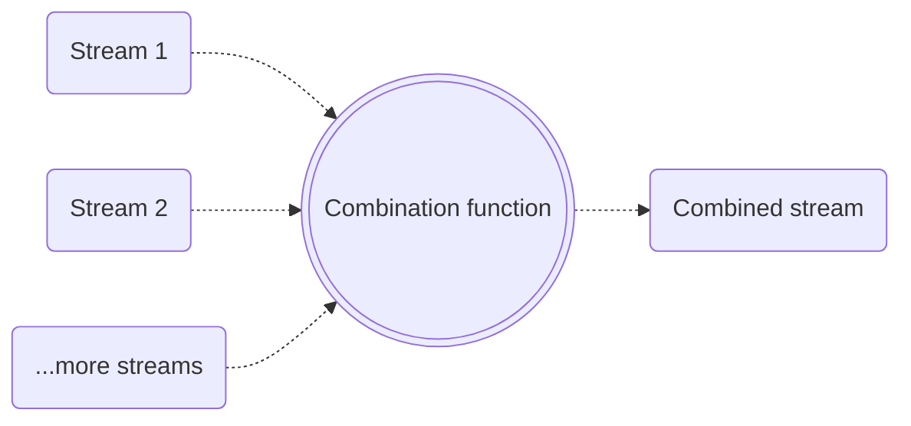

# Step 9: Combining streams

<div class="dense">

- Sometimes we need to combine data from two or more observable streams
- A good example of this is when a page or feature relies on a combination of data from multiple endpoints:



</div>

---

# Step 9: combineLatest

<div class="dense">

- [`combineLatest`](https://rxjs.dev/api/operators/combineLatest) takes an array of Observables and transforms the latest values from all streams into a single stream
- Subsequent transforms (using the `pipe` method) will receive the latest values as a tuple: `[valueFromObs1, valueFromObs2]` to be transformed based on the function return value
- When using this operator, all supplied streams must emit at least a single value before any downstream values will be emitted
- For this reason `startWith` can be very useful to avoid blocking the stream:

```typescript
const myObservable = combineLatest(
  functionThatReturnsMainData(),
  // Will allow the stream to start with `null` initially as the value for the stream
  functionThatReturnsSecondaryData().pipe(startWith(null))
).pipe(([mainData, secondaryDataPossiblyNull]) => {
  // Combine the two streams
});
```

</div>

---

# Step 9: Exercise 💻

<div class="dense">

- Create a service method in the movies service that retrieves the list of movies that the user has added to their watchlist by calling the `account/${userId}/watchlist/movies` endpoint
- 💡 You only need to return a list of movie ids which can be extracted from the returned payload
- Use the `combineLatest` operator in the movie list component to combine the two streams
- 💡 You can use the helper function `withWatchListFlag` (from `@app/utilities`) to combine the arrays from the two streams, e.g. `withWatchListFlag(moviesQuery?.data, watchListQuery?.data)`
- Use the boolean flag that is now included in each movie summary object to disable the "Add to watchlist" button if the movie is already on the users watchlist

</div>

---

# Step 9: Trying it out

<div class="dense">

- Add a movie to your watchlist by clicking the "Add to watchlist" button
- Refresh the page
- The "Add to watchlist" button should now be disabled for the added movie


</div>
