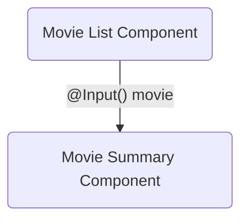

# Step 5: Sharing data between parent and child components

<div class="dense">

- A common pattern in Angular for sharing data between parent and child components is to use the `@Input` decorator:

</div>



---

# Step 5: Inputs

<div class="dense">

- You can define an `@Input` for values that your component receives from its parent:

```typescript
class MyComponent {
  @Input() title: string;
}
```

- The parent can pass literal values for the input, or use [property binding](https://angular.io/guide/property-binding) to bind to one of its own properties:

```html
<my-component title="title"></my-component>
<my-component [title]="title"></my-component>
```

</div>

---

# Step 5: Exercise 💻

<div class="dense">

- Create a movie summary card component that takes a `movie` summary as an input and displays the movie title, overview, and poster image
- The poster image will need to be added to the response of the movie service, the **TMDB** API will return a `poster_path` from the `movies/popular` endpoint
- Bind the movie image to an `img` tag's `src` attribute, and the movie title to the `alt` attribute using [property binding](https://angular.io/guide/property-binding)
- 💡 Speed things up by copying and pasting the relevant code from the movie list component (while removing the `*ngFor` directive)
- 💡 You will need to convert the relative `poster_path` to an absolute URL using the `tmdbPosterThumbnailUrl` utility provided in `@app/utilities`
- 💡 Add a non-null assertion to the `movie` (`@Input() movie!: MovieSummary;`) property to let TypeScript know that you will always pass this to the component (or alternatively use [a more comprehensive approach](https://timdeschryver.dev/blog/required-input-parameters) for required inputs)
- 💡 Surround the image and overview in a container with a `flex` class to place the image and text next to each other

</div>

---

<div class="dense">

# Step 5: Trying it out

- You can add your new movie summary card component to the list of `imports` for the movie list component in order to use it within the move list template
- Use [property binding](https://angular.io/guide/property-binding) to bind the current value of the popular movies stream to the `movie` input of the movie summary card component
- Your output should resemble the following:


</div>
