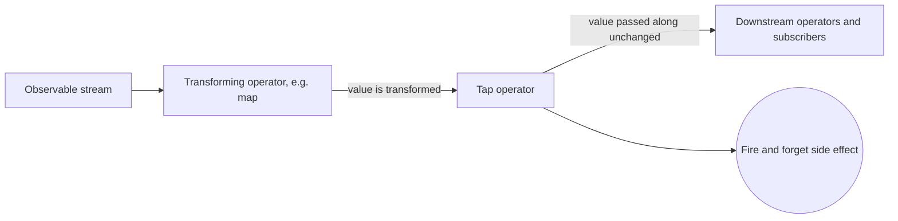

# Step 10: Auto refresh

- Sometimes an action needs to be carried out as part of the stream, for example to persist a value to `localStorage`
- With **RxJS**, this is achieved using the `tap` operator
- When this is included as part of the observable `pipe`, the supplied function is ran, its return value is discarded and the value is passed along unchanged to any downstream operators or subscribers

---

# Step 10: Exercise 💻

- Create a `Subject` property in the movie service to be used to indicate when the watch list is updated (typed as `void`) 
- Combine this with stream in the watch list query (taking care not to block the stream)
- After posting to the watch list in the service, trigger the watchlist updated subject
- As a bonus, update the movie summary card to show a "Remove from watchlist" button that removes the movie from the users watch list
- 💡For this you will need to use another `*ngIf` attribute in the template or an `else` block as part of the existing `*ngIf` attribute
- 💡You will need to add another output to the movie summary card component to emit the remove event to be handled in the movie list component

---

# Step 10: Trying it out

- On the movie list page, click the "Add to watchlist" button and the button should update automatically after it has made the request to the backend 
- If you have completed the bonus step the "Remove from watchlist" button will appear which will the user to also remove items from their watchlist

