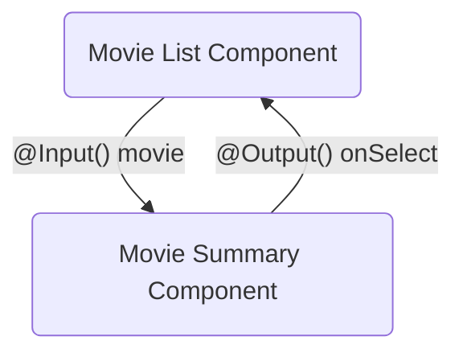

# Step 5: Sharing data between child and parent components

<div class="dense">

- A common pattern in Angular for sharing data between parent and child components is to use the `@Input` and `@Output` decorators

</div>



---

# Step 5: Inputs

<div class="dense">

- You can define an `@Input` for values that your component receives from its parent:

```typescript
class MyComponent {
  @Input() title: string
}
```

- The parent can pass literal values for the input, or use [property binding](https://angular.io/guide/property-binding) to bind to one of its properties:

```html
<my-component title="title"></my-component>
<my-component [title]="title"></my-component>
```

</div>

---

# Step 5: Outputs

<div class="dense">

- The `@Output` decorator allows child components to raise events that can be handled within a parent
- To raise an event, an `@Output()` must have the type of `EventEmitter`
- This is a generic type that takes the type of the value emitted
- The child can invoke the `emit` method to publish the value:

```typescript
export class MyComponent {
  @Output() onNewItem = new EventEmitter<string>()

  addNewItem(value: string) {
    this.onNewItem.emit(value)
  }
}
```

- The parent can use [event binding](https://angular.io/guide/event-binding) to handle the event:

```html
<my-component (onNewItem)="handleNewItem($event)"></my-component>
```

</div>

---

# Step 5: Exercise 💻

<div class="dense">

- Create a movie summary card component that takes a movie summary as an input and displays the movie title, description, and poster image
- The poster image will need to be added to the response of the movie service, the **TMDB** API will return a `poster_path` from the `movies/popular` endpoint
- Bind the movie image to an `img` tag's `src` attribute, and the movie title to the `alt` attribute using [property binding](https://angular.io/guide/property-binding)
- 💡 You will need to convert the relative `poster_path` to an absolute URL using the `tmdbPosterThumbnailUrl` utility provided
- 💡 You can use the [Material UI Card](https://material.angular.io/components/card/overview) component to style the movie summary

</div>

---

# Step 5: Trying it out

<div class="dense">

- You can add your new movie summary card component to the list of `imports` for the movie list component to use it
- Use [property binding](https://angular.io/guide/property-binding) to bind the the current value of the popular movies stream to the movie input of the movie summary card component
- Your output should resemble the following:


</div>
