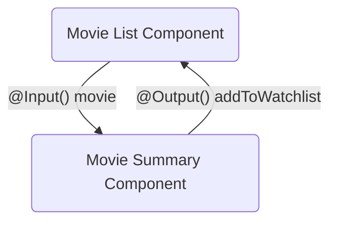

# Step 7: Responding to events

<div class="dense">

- Using the Angular `@Output` decorator, the application can respond to UI events:



</div>

---

# Step 7: Outputs

<div class="dense">

- The `@Output` decorator allows child components to raise events that can be handled within a parent
- To raise an event, an `@Output()` must have the type of `EventEmitter`
- This is a generic type that takes the type of the value emitted
- The child can invoke the `emit` method to publish the value:

```typescript
export class MyComponent {
  @Output() onNewItem = new EventEmitter<string>()

  addNewItem(value: string) {
    this.onNewItem.emit(value)
  }
}
```

- The parent can use [event binding](https://angular.io/guide/event-binding) to handle the event:

```html
<my-component (onNewItem)="handleNewItem($event)"></my-component>
```

</div>

---

# Step 7: Error handling

<div class="dense">

- To handle errors within a service, RxJS provides the [`throwError`](https://rxjs.dev/api/index/function/throwError) operator
- This will create an Observable that will create an error, and then error each time a consumer subscribes to the stream
- The operator takes an error factory, a function that returns the error:

```typescript
return throwError(() => new Error('There was an error'))
```

- This can be used within Angular services to handle error cases such as invalid method parameters or HTTP error responses

</div>

---

# Step 7: Exercise 💻

<div class="dense">

- Add a mutation method to the movie service that adds a movie to a watchlist
- You will need to POST to the TMDB `account/{userId}/watchlist` endpoint
- 💡 See the [TMDB API Documentation](https://developers.themoviedb.org/3/account/add-to-watchlist) for details of the request body and response
- You can inject the provided `AuthService` to access the current user id using `currentUser()?.id`
- 💡 You should use the `throwError` operator to handle the case of no current user
- Add a **watch** button to the movie summary card component and use [event binding](https://angular.io/guide/event-binding) to handle the button `click` event
- Invoke the mutation on the movie service when the **watch** button is clicked

</div>

---

# Step 7: Trying it out

<div class="dense">

- To test the add to watchlist mutation, you can inspect the Network tab in your browser developer tools
- The POST request should return a 201 response

</div>
